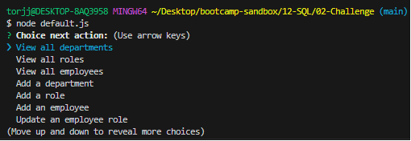
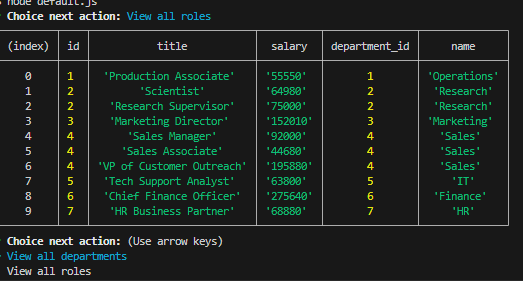

# Employee Database SQL tool
GitHub page: https://github.com/tjansson-ui/employeeSQLdb

This is a Command Line Employee Database tool.
Initiate the program with passing the following script in the command line 
```
node default.js
```

You should be greeted with the following Navigation menu


Clicking a menu option should either display the relevant information or prompt for user inputs. 



## Troubleshooting
Please ensure you have installed all the relevant node packages by running
```
npm i
```
You should also ensure your mysql is active. Verify this with your mysql script.
An example may look like 'mysql -u root -p"


## Additional Info
The table is set up with the following key information
